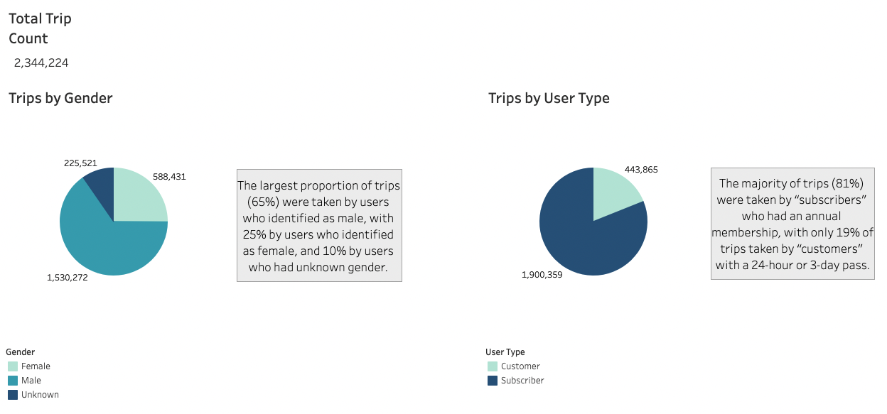
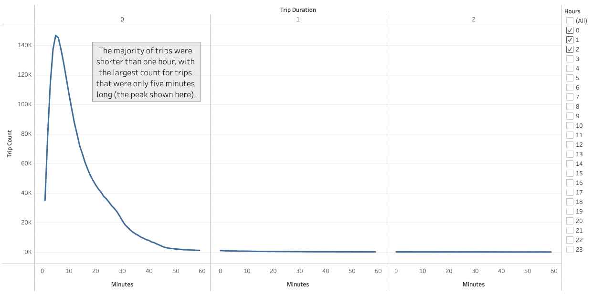
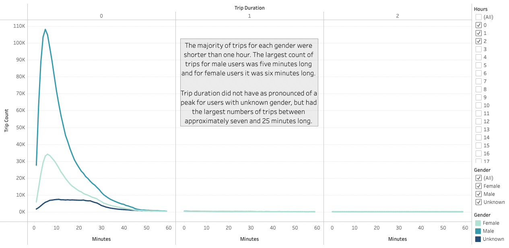
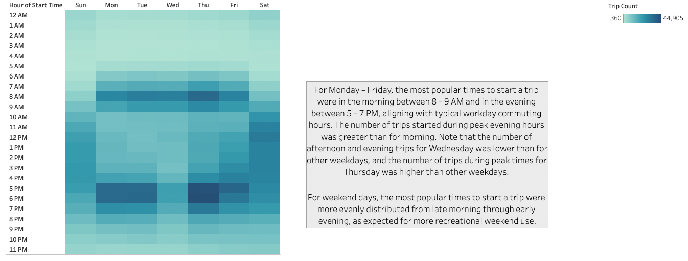
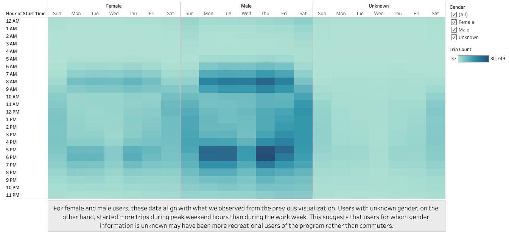
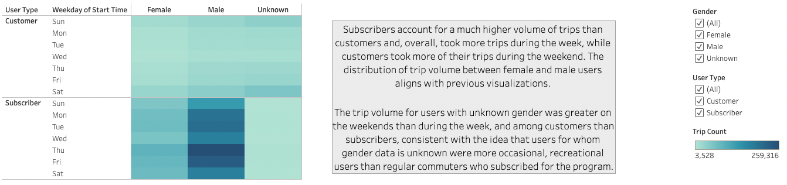
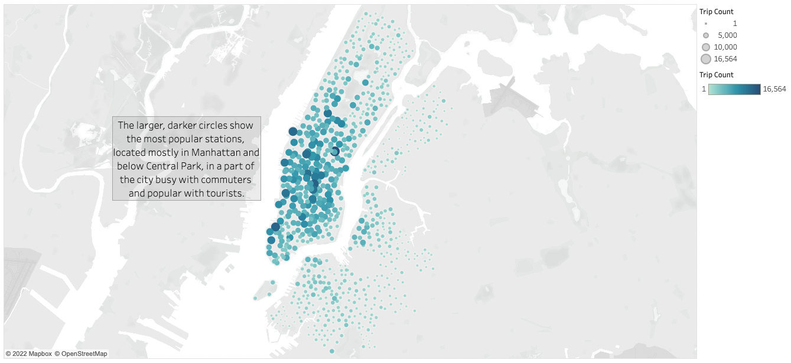

# New York City Citi Bike Data Analysis

## Overview
The purpose of this project was to analyze data from New York City’s Citi Bike program to inform consideration of establishing a similar bike sharing program in another city. Citi Bike trip history data for the month of August 2019 was analyzed and visualizations were created in Tableau to provide insight into utilization of the program by day of the week, time of day, user type, gender, and other variables.

## Results

All analysis for this project was performed using a CSV file of August 2019 trip data downloaded from the [Citi Bike System Data website](https://ride.citibikenyc.com/system-data). The data was visualized with a [story created using Tableau Public](https://public.tableau.com/app/profile/jennifer.amis/viz/NYCCitiBikeDataAnalysis_16517989986100/NYCCitiBikeDataAnalysis). A discussion of each data visualization is below.

### Trips by Gender and User Type

A total of 2,344,224 trips were taken in August 2019 using the Citi Bike bicycles. This visualization helps us to understand the users who took those trips. With respect to gender, the largest proportion of trips (65%, or 1,530,272) were taken by users who identified as male, with 25% (588,431) by users who identified as female, and 10% (225,521) by users who had unknown gender. With respect to user type, the majority of trips (81%, or 1,900,359) were taken by “subscribers” who had an annual membership, with only 19% (443,865) of trips taken by “customers” with a 24-hour or 3-day pass.

### Trip Duration for All Users

This visualization shows us the count of all Citi Bike trips by duration, reported in minutes and hours. We can see that the majority of trips were shorter than one hour, with the largest count for trips that were only five minutes long (the peak on the graph). 

### Trip Duration by Gender

This visualization shows the same data as the previous one (count of Citi Bike trips by duration), broken down by gender. Consistent with the previous visualization, the majority of trips for each gender were shorter than one hour. The largest count of trips for male users was five minutes long and for female users it was six minutes long. Trip duration did not have as pronounced of a peak for users with unknown gender, but had the largest numbers of trips between approximately seven and 25 minutes long. 

### Trips by Weekday and Hour of Start Time

This visualization uses a heatmap to show us the volume of trips started for each hour of each day of the week. We can see that during the week (Monday – Friday), the most popular times to start a trip were in the morning between 8 – 9 AM and in the evening between 5 – 7 PM, aligning with typical workday commuting hours. The number of trips started during peak evening hours was greater than for morning. Interestingly, the number of afternoon and evening trips for Wednesday was lower than for other weekdays, and the number of trips during peak times for Thursday was higher than other weekdays. For the weekend days, the most popular times to start a trip were more evenly distributed from late morning through early evening. This is also as expected for more recreational weekend use.

### Trips by Gender, Weekday and Hour of Start Time

This visualization shows the same data as the previous one (trips started for each hour of each day of the week), broken down by gender. Since male users account for the largest proportion of trips, their data most closely resembles the previous heatmap. For female users, peak days and times also align with what we observed from the previous map. However, we see that users with unknown gender started more trips during peak weekend hours than during the work week. This suggests that users for whom gender information is unknown may have been more recreational users of the Citi Bike program rather than commuters.

### Trips by Gender, Weekday and User Type

This visualization shows the volume of trips started for each day of the week, broken down by gender and user type. As we saw earlier, subscribers account for a much higher volume of trips than customers. Overall, we see that subscribers had more trips during the week, while customers had more trips during the weekend. The distribution of trip volume between female and male users aligns with previous visualizations. The trip volume for users with unknown gender was greater on the weekends than during the week, and among customers than subscribers, consistent with the idea that users for whom gender data is unknown were more occasional, recreational users than regular commuters who subscribed for the program.

### Starting Location Popularity

This visualization shows the number of trips started from the various Citi Bike stations across New York City. The larger and darker the circle is, the more popular the station as a starting point for trips. We can see the most popular stations located in Manhattan, mostly below Central Park, in a part of the city busy with commuters and popular with tourists. 

## Summary

Based on the analysis of August 2019 trip data, the New York City Citi Bike program appears to be well-utilized for both commuting and recreational purposes, with the largest volume of trips starting before and after work during the week and during the day on weekends. During the period analyzed, the program was most heavily utilized by males and subscribers with an annual membership. With the majority of trips being under an hour, bicycle resources were not typically tied up for an extended period by a single user, allowing for high trip volume. The short trip durations make sense given the Citi Bike program’s pricing model, which charges additional fees for rides longer than 45 minutes for subscribers and longer than 30 minutes for customers. Since New York City is a dense city with many points of interest close together, this likely works well, but trip durations might tend to be longer in a city that is more spread out.

An additional visualization that would be of value is a graph of trip duration by user type, similar to the one of trip duration by gender. It would be of interest to see how the actual trip durations for these groups compare to the duration they are allowed ride before incurring additional fees. This information could help to inform the pricing model for a bike sharing program in another city.

Another visualization that would be of value is a pie chart showing trips by birth cohort (for example, by decade of birth). Creating this pie chart would first require using the birth year field to create a birth cohort calculated field. Since the additional pie chart would show the distribution of trips among users in different birth cohorts, it would allow investors to see how utilization aligns with the age demographics of their city and, once the program is established, target their promotion activities to the age group(s) most likely to utilize it. A note of caution for this analysis is that there are likely data errors in the available birth year data. For example, the data includes birth years as early as 1885, which would mean the user was 134 years old when using the Citi Bike program in 2019.
